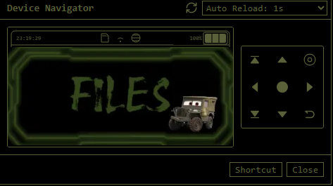

# 🚗 Theme Cars - Bruce Firmware (T-Embed CC1101)

[Français](#français) | [English](#english)

---

## Français

Ce pack contient un thème personnalisé pour le firmware Bruce sur **LilyGO T-Embed (CC1101)**, optimisé avec des images au format BMP 24-bits (sans transparence) pour de meilleures performances.

### 📦 Contenu du pack
* Fichiers `.bmp` (Icônes de l'interface)
* `Theme_Cars.json` (Fichier de configuration du thème)
* `boot.gif` (Animation de démarrage optimisée en 320x170)

### ⚙️ Procédure d'installation (LittleFS)

Pour installer ce thème dans la mémoire interne (**LittleFS**) de votre T-Embed :

1. **Connectez votre T-Embed** à votre ordinateur (via l'outil web officiel de Bruce ou votre outil de flash/gestion de fichiers habituel).
2. Ouvrez l'explorateur de fichiers et accédez au système de fichiers interne **LittleFS** du firmware.
3. Naviguez jusqu'au dossier `/Themes`.
4. **Copiez le dossier** `Theme_Cars` (contenant les fichiers `.bmp` et le fichier `Theme_Cars.json`) directement à l'intérieur du dossier `/Themes`.
5. Placez le fichier `boot.gif` à la racine du répertoire LittleFS.
6. **Redémarrez le T-Embed** et activez le thème depuis le menu des paramètres de l'interface.

---

## English

This pack contains a custom theme for the Bruce firmware running on the **LilyGO T-Embed (CC1101)**, optimized with 24-bit BMP images (no transparency) for maximum performance.

### 📦 Pack Contents
* `.bmp` files (UI Icons)
* `Theme_Cars.json` (Theme configuration file)
* `boot.gif` (Optimized 320x170 boot animation)

### ⚙️ Installation Procedure (LittleFS)

To install this theme into the internal memory (**LittleFS**) of your T-Embed:

1. **Connect your T-Embed** to your computer (using the official Bruce web tool or your preferred file manager/flashing tool).
2. Open the file explorer and access the internal **LittleFS** storage of the firmware.
3. Navigate to the `/Themes` directory.
4. **Copy the** `Theme_Cars` folder (containing the `.bmp` files and `Theme_Cars.json`) directly into the `/Themes` folder.
5. Place the `boot.gif` file at the root of the LittleFS directory.
6. **Reboot your T-Embed** and select the theme from the UI settings menu.

[Bruce Firmware](https://github.com/BruceDevices/firmware)

[Bruce Firmware Easy Install](https://bruce.computer/flasher)

[LilyGO T-Embed (CC1101)](https://www.lilygo.cc/products/t-embed)
